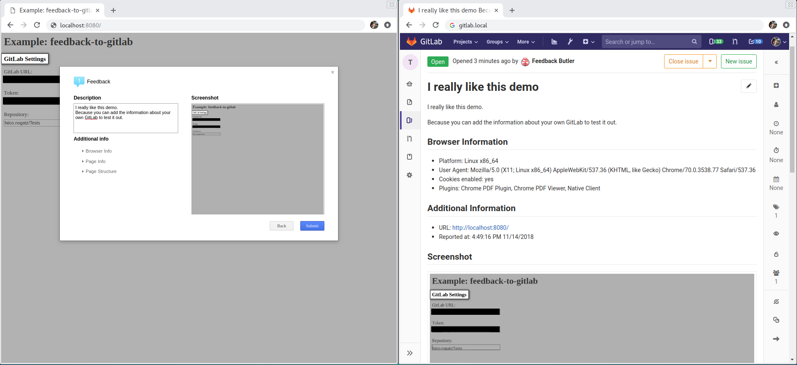

# feedback-to-gitlab

Express middleware to create Gitlab issues from user feedback generated by [ivoviz/feedback](https://github.com/ivoviz/feedback)



## Installation

```js
npm install feedback-to-gitlab
```

## Usage

```js
var express = require('express')
var feedback = require('feedback-to-gitlab')
var app = express()

app.post('/feedback', feedback({
  url: 'https://gitlab.url.com',
  token: 'abcdefghij123456',
  repository: 'some/repo'
}))

app.listen(80)
```

On the website where you want to gain user feedback you have to include [ivoviz/feedback](https://github.com/ivoviz/feedback). Example configuration:

```js
jQuery.feedback({
  ajaxURL: 'http://url.com/feedback',
  html2canvasURL: 'html2canvas.min.js'
})
```

A method do run `feedback-to-gitlab` in a docker container is described in the [wiki](https://github.com/fnogatz/feedback-to-gitlab/wiki/Docker).

## Configuration

### url (String, required)

Base url of your Gitlab instance.

### token (String, required)

User token for Gitlab.

### repository (String or Number, required)

The path with namespace (e.g. `'some/repo'`) or ID (`123`) of the Gitlab repository where the issues are created.

### auth (Object)

User credentials of the form `{ user: 'some', password: 'credentials' }` if your Gitlab instance requires HTTP basic access authentication.

`Default: null`

### labels (Array)

List of labels to tag the created issue.

`Default: [ 'new' ]`

### store.repository (String or Number)

By default the screenshots are uploaded to the same repository where the issue is created. Use this option to define a different repository by its namespace (e.g. `'some/other-repo'`) or ID (`124`).

`Default: repository`

### store.branch (String)

Name of the branch where the screenshots will be stored.

`Default: 'master'`

### store.path (String)

Directory where the screenshots will be stored in the repository.

`Default: 'screenshots'`

### store.limit (String)

Limit the file size of the screenshot.

`Default: '1mb'`
